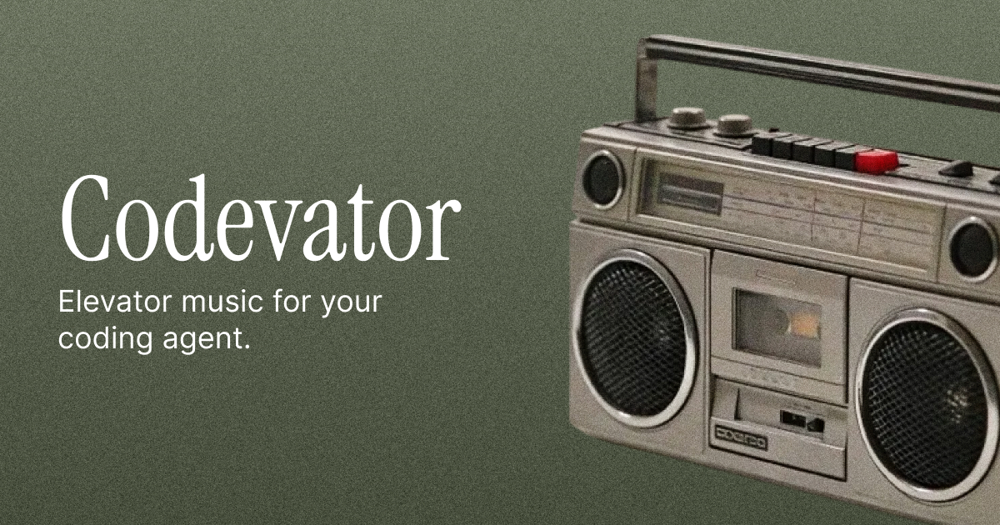

# codevator



Elevator music for your AI coding agent.

Background sounds that play while [Claude Code](https://docs.anthropic.com/en/docs/claude-code) works and stop when it needs your attention.

**Website: [codevator.dev](https://codevator.dev)**

## Quick Start

```bash
npx codevator
```

That's it. Next time Claude Code starts working, you'll hear elevator music.

## Sound Modes

Five built-in modes:

| Mode | Description |
|------|-------------|
| `elevator` | Classic smooth jazz elevator music (default) |
| `typewriter` | Rhythmic mechanical keystrokes |
| `ambient` | Soft atmospheric background |
| `retro` | Mellow 8-bit synthesized arpeggios |
| `minimal` | Deep warm hum with slow breathing |

```bash
codevator mode ambient
```

## Commands

```
npx codevator              Install hooks into Claude Code
codevator mode <name>      Set sound mode
codevator volume <0-100>   Set volume level
codevator on / off         Enable or disable sounds
codevator status           Show current settings
codevator uninstall        Remove hooks from Claude Code
```

## How It Works

Codevator registers hooks in Claude Code's settings (`~/.claude/settings.json`):

- **PreToolUse** — starts playback when the agent begins working
- **Stop** — stops playback when the session ends
- **Notification** — stops on permission prompts and idle states

Music plays through your system's native audio player (`afplay` on macOS, `paplay`/`aplay` on Linux). Config is stored at `~/.codevator/config.json`.

## Packages

| Package | Description |
|---------|-------------|
| [`packages/cli`](packages/cli) | CLI tool — [npm](https://www.npmjs.com/package/codevator) |
| [`packages/web`](packages/web) | Promotional website — [codevator.dev](https://codevator.dev) |

## Development

```bash
pnpm install
pnpm dev:web    # Next.js dev server
pnpm dev:cli    # CLI watch mode
pnpm build      # Build all packages
```

## License

MIT
